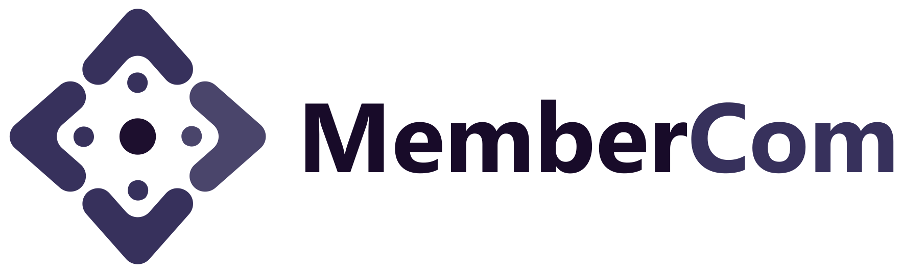
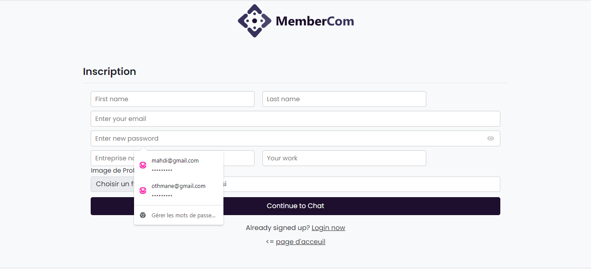
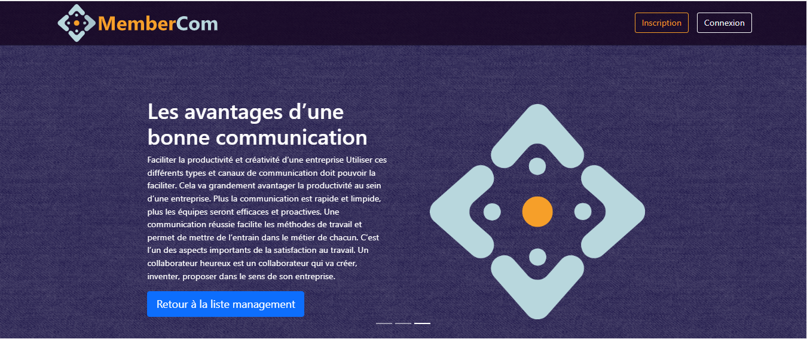
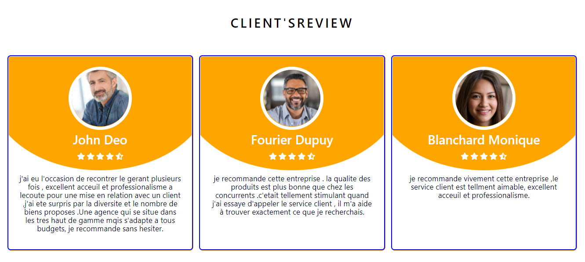
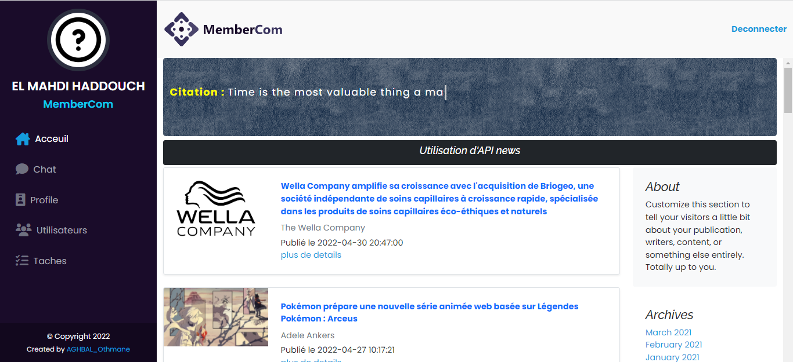
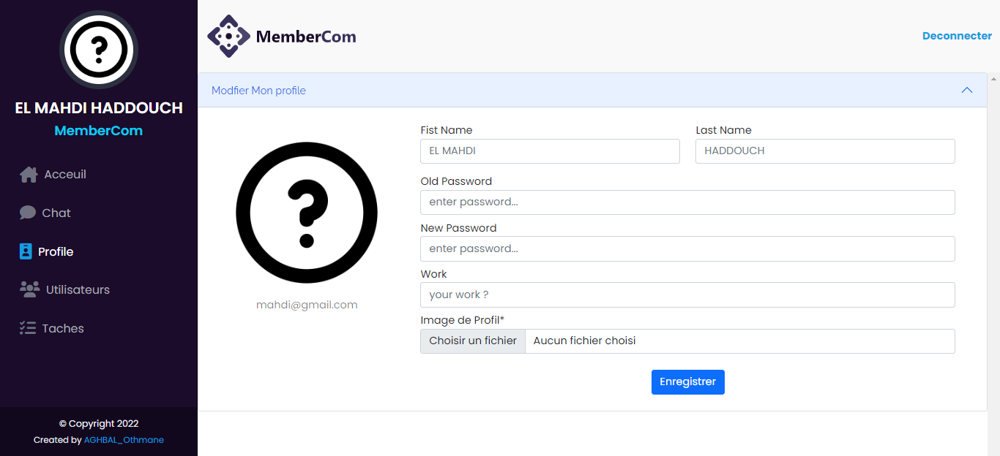
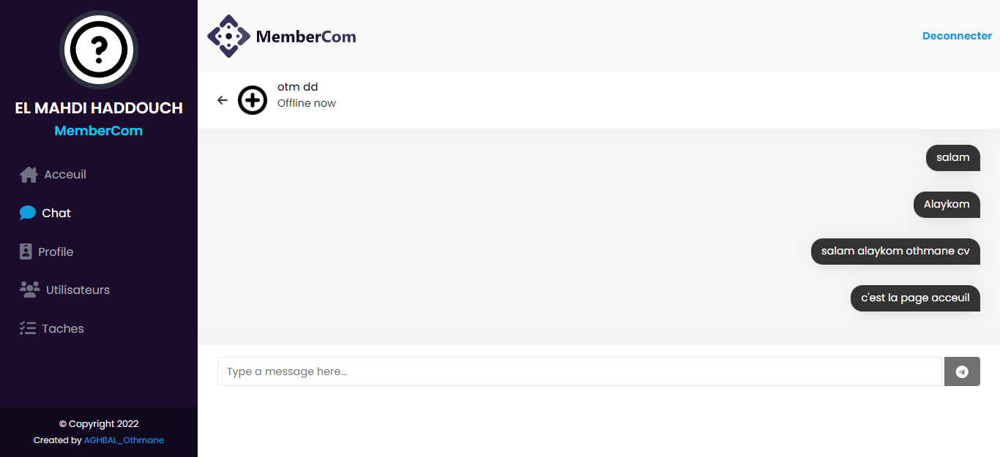
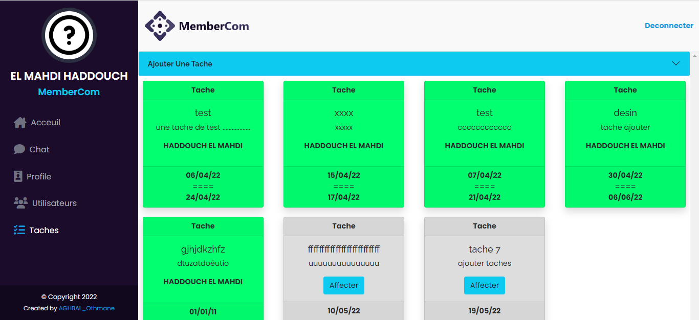
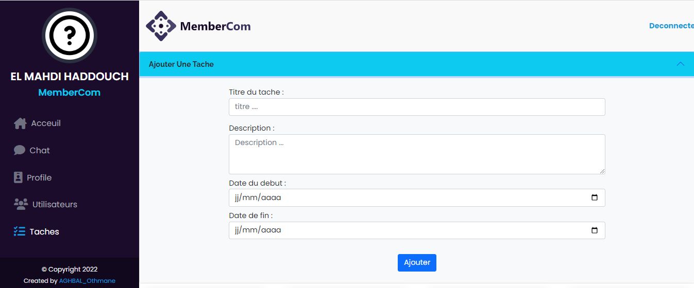
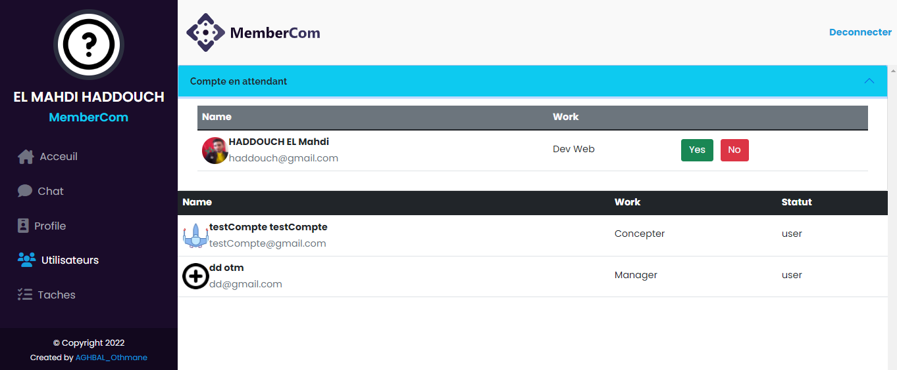

# RAPORT APPLICATION WEB

## **Groupe 1**
---

|La communication interne entre les membres d'entreprise    |
| -------- |---------|
___
**Date: 26/04:2022** 
| Destinataire : LHABABDELBASSET Annaki|
| -------- |---------|
### *Les membres du groupe*
| NOM      | PRENOM  |
| -------- |---------|
| HADDOUCH | EL Mahdi|
| AGHBAL   | Othmane |
| DAIZE    |  Samiya |

#### *SOMMAIRE :*
* INTREDUCTION
* Presentation de l’application
* Inetrfaces
* Conclusion

### *I. INTRODUCTION :*
* La communication interne entre les membres d'une entreprise est hyper importante, Elle permette aux collaborateurs de mieux accéder à l'information et de mieux communiquer ensemble. Cela concerne tous les statuts, de l'exécutant au top manager.

* Les objectifs de la communication interne entre les memberes d'entreprise et de transmettre des messages,partager d'informations, travailler en équipe ,partager les taches,et avoir les informations sur l'état d'avancement des taches.
 
* L’un des objectifs principaux de la communication interne est la création d’une identité collective, un sentiment d’appartenance à un même groupe, une cohésion entre les différentes équipes, afin que toutes et tous travaillent ensemble à la réussite du projet commun d’entreprise. 
*  Communication interne : tous responsables ?  
“La communication interne permet ainsi à l’entreprise de former : permettre à ses collaborateurs d’acquérir de nouvelles compétences, informer : à travers des outils tels que le journal d’entreprise, motiver : intégrer les employés au projet d’entreprise en valorisant leur rôle, et de fédérer : donner un sentiment d’appartenance en capitalisant sur des valeurs et objectifs communs.”

* ### *II.	PRESENTATION DE L4APPLICATION de *
    * **A.	1. LES OBJECTIFS DE L’APPLICATION :**
*  L’objectif principal de notre application web est de rassembler tous les membres qui travaillent dans la même entreprise pour apporter des solutions concrètes à un  problème qui est la gestion de la communication.
*   L'application **MemberCom**  donne la posibilité aux nouveaux membres d'inscrire et elle offre une grande mobilité et un accès facile à partir de n'importe quel appareil , n'importe où et à tout moment avec une simple connexion a votre compte.
*   L'application **MemberCom** permette de discuter en temps reel avec tous les membres travaillant au sein d’une entreprise.
*   L'application **MemberCom** permette d'ajouter des taches seulement par admin et des publications et tout en archivant l’historique des echanges.
    * **A. 2. LES CIBLES :**
 Nous visons un public professionnel, des gens qui travaillent en collaboration au sein d’une même entreprise , directeur et employés .
    * **A. 2. MemberCom :**
L’application web qu’on a développe est intitulé **MemberCom** composé de 5 interfaces principaux et une site vitrine.
* ### *QUELLES SONT LES INFORMATIONS SAISIES POUR L'INSCRIPTION ?*

* ### *III.	INTERFACES :*
     **[ 1. SITE VITRINE:]( ./index.php)** 
Le site vitrine est compose de deux boutons inscription et connexion , d’un slider contenant des infos sur l’entreprise , les opinions des utilisateurs et des statistiques .

    **[ 2. ACCEUIL:]( ./Acceuil.php)** 
Dans cette intereace on trouve la barre menu qui ramène vers d’autres interfaces d’application, les news pour ceci nous avons travaillé en utilisant les API des news et citations codé par javaScript …
Il ya aussi un bouton Deconnecter afin de revenir à l'interface de connexion 

    **[ 3. PROFILE:]( Profile.php)**
A  cette interface l’employé peut modifier son profil , son mot de passe, sa photo de profil …. Toutes ces modifications vont être enregistrées dans une base de données  . 

    **[ 4. CHAT:]( ./chat.php)**
 Ici les utilisateurs peuvent communiquer entre eux en temps réel  , tout en gardant l’historique des messages envoyés
  
    **[ 5. TACHES:]( ./Taches.php)**
* A ce stade si la personne est connecte en tant que admin , elle peut ajouter des nouvelles taches dans un tableau , et si elle est connecté en tant que utilisateur peut visualiser la table des taches et en choisir une . 
* Si un employe a choisi une taches parmi ce qui est affiché par l’admin un autre employe dans le même entreprise n’a plus le droit de choisir cette même taches.
* Lorsque un utilisateur clique sur le bouton affecter cette tache a enregistré par son nom(il devient la responsable de cette tache)
* Un utilisateur peut enregistrer plusieurs taches à son nom 

* *Les informtions qui sont  inserer par admin pour ajouter une tache:*

**[ 6. UTILISATEURS:]( ./Utilisateurs.php)**
Cet interface contient les informations des utilisateurs de l’application ,
avec un champ qui contient la liste des nouveaux inscriptions qui vont accepter par admin s'il clique sur le bouton oui. Il ya aussi champ statut qui détermine si il s’agit d’un utilisateur normal(employé) ou admin , toutes les infos relatives aux utilisateurs sont enregistrées dans une base de données , quelque une sont affichées sur cet interface , par exemple le nom et le prénom de l’utilisateur , son adresse mail , son métier et ainsi que son statut .

* ### *IV. CONCLUSION :*
*  **MemberCom** est l’application qui va faciliter la communication inter entreprise , contrôler et affecter facilement des taches a ses employés … Avec un simple geste vous êtes connectes a votre compte et pouvoir communiquer avec vos collègues , rester au courant des dernières actualités de l’entreprise et enfin pouvoir gérer et contrôler le partage des taches entre les employées .

